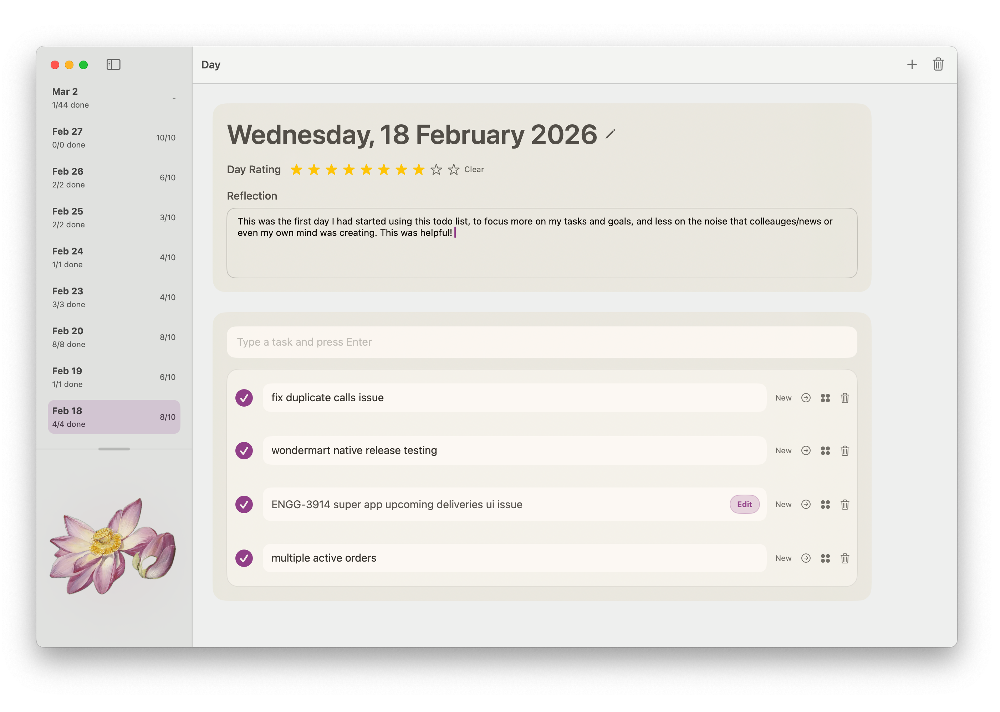

# FocusedDayPlanner

FocusedDayPlanner is a native macOS planner built with SwiftUI and SwiftData for people who want a calm daily workspace instead of a cluttered task app.

## Agent Guide

Repository-specific implementation notes for coding agents and new contributors live in [AGENTS.md](AGENTS.md).



## What’s New In 1.1
- dedicated **Sound Mixer** page with mixable ambient sound-effect tiles
- pause/resume that preserves your exact custom sound mix
- sidebar page highlighting for planner destinations
- menu bar launcher for quick reopen access
- wellness-break overlays and reminder controls
- UI zoom controls for better readability on different displays
- refreshed settings layout and richer app polish

## Core Experience
- **Today** for focused day planning
- **All Todos** for a cross-day view of every task
- **Calendar** for navigating daily summaries month by month
- **Stats** for completion and rating trends
- **Journal** for reflection history
- **Sound Mixer** for blending rain, wind, waves, leaves, thunderstorm, and restaurant ambience
- **Settings** for reminders, appearance, storage, and audio configuration

## Features
- day-based todo planning with reorderable tasks
- carry-forward workflow for unfinished work
- day rating and written reflection
- sidebar history of recent days
- local-first data storage with JSON import/export
- configurable todo reminders with custom cadence and message text
- optional wellness reminders every 10 to 180 minutes
- dedicated sound mixer with click-to-balance and drag-to-set levels
- sound-effect cache folder access from Settings
- menu bar entry to reopen the planner quickly
- adjustable UI scale with keyboard shortcuts
- theme tint customization and decorative sidebar artwork

## Sound Mixer
The Sound Mixer is a dedicated sidebar page for building a background ambience mix while you work.

- click a sound tile to activate it and rebalance all active tiles evenly
- drag across a tile to set that tile anywhere from `0%` to `100%`
- pause and resume without losing your current mix
- use the toolbar mini-player for quick playback and master volume control
- built-in effects currently include:
  - walking on leaves
  - whistling wind
  - thunderstorm
  - leaves rustling
  - calming rain
  - soothing ocean waves
  - busy restaurant ambience

## Credits And Licensing
FocusedDayPlanner includes third-party media references and bundled decorative artwork. Keep this section up to date whenever media assets change.

### Sound Effects
The built-in sound mixer currently resolves audio from Pixabay sound-effect pages at runtime and caches the downloaded files locally.

- License basis: Pixabay states its content is free to use, attribution is not required, and use is governed by the Pixabay Content License summary:
  - [Pixabay Content License Summary](https://pixabay.com/service/license-summary/)
- Current configured sound pages and creator credits:
  - [walking-on-leaves](https://pixabay.com/sound-effects/walking-on-leaves-260279/) by `MUSICHOLDER`
  - [wind-whistling-window-frame](https://pixabay.com/sound-effects/wind-whistling-window-frame-70595/) by `pavelvon` / `freesound_community`
  - [thunderstorm](https://pixabay.com/sound-effects/thunderstorm-14708/) by `regosss` / `freesound_community`
  - [leaves-rustling](https://pixabay.com/sound-effects/leaves-rustling-14633/) by `ericnorcross81` / `freesound_community`
  - [calming-rain](https://pixabay.com/sound-effects/calming-rain-257596/) by `Liecio`
  - [soothing-ocean-waves](https://pixabay.com/sound-effects/soothing-ocean-waves-372489/) by `DRAGON-STUDIO`
  - [busy-restaurant-dining-room-ambience](https://pixabay.com/sound-effects/busy-restaurant-dining-room-ambience-128466/) by `DOBCommunications`

### Decorative Images
The sidebar artwork currently ships from `assets/overlays/image-*.png`.

- Current status: the original external source URLs and license notes for these bundled PNG files are not documented in-repo.
- Recommendation: before wider distribution, document the exact origin and license for each decorative image or replace them with assets whose source and license are tracked in the repository.
- Repository location:
  - `assets/overlays/image-1.png`
  - `assets/overlays/image-2.png`
  - `assets/overlays/image-3.png`
  - `assets/overlays/image-4.png`
  - `assets/overlays/image-5.png`
  - `assets/overlays/image-6.png`
  - `assets/overlays/image-7.png`
  - `assets/overlays/image-8.png`
  - `assets/overlays/image-9.png`

## Notifications
The app requests notification permission for planner reminders.

- pending todos trigger reminders between `11:00` and `17:00` using your chosen interval
- both the unfinished-todo message and empty-day prompt can be customized in Settings
- completed days do not trigger hourly todo reminders
- wellness reminders can repeat on your chosen interval
- test and permission-check actions are available in Settings

## Requirements
- macOS 14+
- Xcode or Swift toolchain with the `swift` CLI available

## Run
```bash
cd ~/Developer/FocusedDayPlanner
swift run
```

## Build
```bash
cd ~/Developer/FocusedDayPlanner
swift build
```

Release build:
```bash
cd ~/Developer/FocusedDayPlanner
swift build -c release
```

## Test
```bash
cd ~/Developer/FocusedDayPlanner
swift test
```

## Package As A macOS App
```bash
cd ~/Developer/FocusedDayPlanner
./scripts/package-app.sh
```

This creates:
- `~/Developer/FocusedDayPlanner/dist/FocusedDayPlanner.app`

Non-interactive build:
```bash
cd ~/Developer/FocusedDayPlanner
./scripts/package-app.sh --no-install
```

Create a DMG:
```bash
cd ~/Developer/FocusedDayPlanner
./scripts/create-dmg.sh
```

This creates:
- `~/Developer/FocusedDayPlanner/dist/FocusedDayPlanner-<version>-<build>.dmg`

## Data And Storage
- planner data is stored locally via SwiftData
- default store location:
  - `~/Library/Application Support/FocusedDayPlanner/FocusedDayPlanner.store`
- store metadata file:
  - `~/Library/Application Support/FocusedDayPlanner/StoreMetadata.json`
- sound-effect cache location:
  - `~/Library/Application Support/FocusedDayPlanner/AudioLibrary/Curated/`

## Project Structure
- `Sources/FocusedDayPlanner/FocusedDayPlannerApp.swift` - app entry, window setup, menu bar integration
- `Sources/FocusedDayPlanner/PlannerRootView.swift` - main navigation and primary UI
- `Sources/FocusedDayPlanner/PlannerStore.swift` - persistence operations and planner business logic
- `Sources/FocusedDayPlanner/BackgroundAudioController.swift` - sound mixer state, caching, and playback
- `Sources/FocusedDayPlanner/DailyReminderScheduler.swift` - reminder scheduling
- `Sources/FocusedDayPlanner/PersistenceController.swift` - store location and migrations
- `scripts/package-app.sh` - app bundling
- `scripts/create-dmg.sh` - DMG packaging

## Versioning And Releases
- marketing version comes from `VERSION`
- build number defaults to `git rev-list --count HEAD`
- tagged releases using `v*` can be used by CI packaging workflows

## Repository Notes
- this app is local-first by design
- import replaces existing planner content with the imported snapshot
- future schema migrations should be added in `PersistenceController.applyMigration(toVersion:storeDirectory:)`
